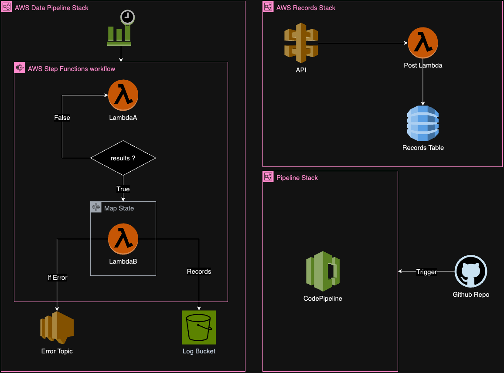

# Cloud Engineer Challenge

## Overview

This project aims to deploy infrastructure on AWS using AWS CDK with TypeScript to support an energy market auction
service. The infrastructure includes three different Stacks:

- `Orders Stack`: Service to receive and store orders in the table through an API
- `Data Pipeline Stack`: Service to submit orders to an Auction Platform
- `CI/CD Pipeline Stack`: CI/CD pipeline to automate deployment to different environments



## Repository Structure

- `bin/`: Contains our CDK app.
- `lib/`: Contains the CDK stacks + code for lambda function
- `tests/`: Holds test scripts for AWS CDK constructs + Python tests.

## Prerequisites

1. Install Node.js and `npm install --include=dev`.
3. (For Lambda unit testing) Install Python 3.9 and run `pip install -r test/lambda_test/requirements.txt`.

## Infrastructure Components

1. **API Gateway**: Accepts POST requests with order data.
2. **Lambda Functions**:
    - Lambda A: Processes orders and stores data in DynamoDB.
    - Lambda B: Processes results, stores in S3, and handles error notifications.
    - Lambda Post: Process the orders submitted through the API.
3. **DynamoDB**: Stores order data.
4. **S3 Bucket**: Stores submitted orders for log purposes.
5. **EventBridge**: Schedules the data pipeline execution.
6. **GitHub Actions Workflow**:
    - Automated deployment on merge to master branch.
    - Run tests for AWS CDK constructs.

## Deployment Pipeline

- **Dev Environment**:
    - Automatic deployment on merge to master branch.
    - GitHub Actions workflow runs tests for AWS CDK constructs + Python tests Lambda Function.
    - CodePipeline workflow build CDK, runs tests for constructs and deploy to Entrix AWS account
    - Test the deployed API post deployment

## Testing

1. Run tests for AWS CDK constructs:
   ```bash
   npm test
2. Run tests for Lambda functions:
   ```bash
   python -m unittest 
